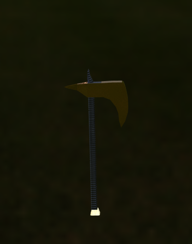
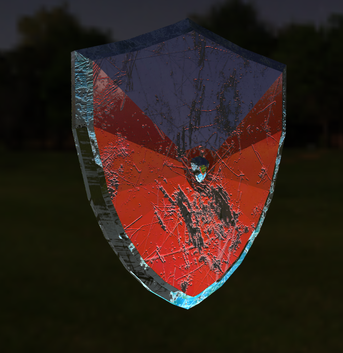
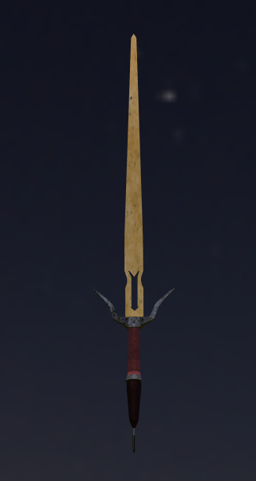
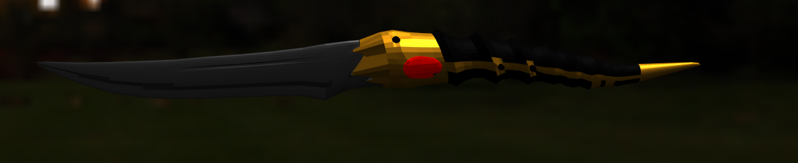
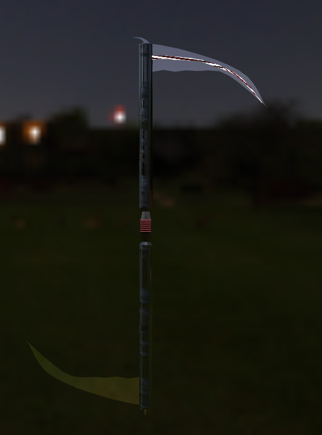

# ProductVisualization - Secondo progetto di Intercative 3d Graphics

### Autore:

Cagnoni Christian - 137690

# Descrizione

Si è deciso di realizzare un semplice sito per la visualizzazione di armi storiche. L'utente può visualizzare l'aspetto dell'arma desiderata, assegnandoli i materiali desiderati. In particolare, è possibile scegliere tra:
- un'ascia;
- uno scudo;
- una spada;
- una piccola spada(non gestita tramite shaders);
- una falce.
Invece, i materiali disponibili sono:
- metallo;
- oro;
- legno;
- metallo pitturato;
- argento;
- tessuto.
Oltre a decidere l'arma visualizzata e i materiali di cui è composta, l'utente può anche interagire con l'oggetto ruotandolo e riscalandolo.

# Strumenti utilizzati

Dal punto di vista software è stato utilizzato:
- Git;
- VS Code;
- Microsoft Edge (86.0.622.61);
- Google Chrome ( 86.0.4240.183);
- Firefox (81.0.1);
- Blender (2.90);

Dal punto di vista hardware:
- CPU: AMD Ryzen 3 3200g 3.60GHz;
- GPU: NVIDIA GTX 1650 Super 4GB;

Per quanto riguarda le performance sono quasi sempre fisse a 60fps. Ci sono alcuni cali quando si cambia oggetto o materiale. Questo è dovuto al fatto che, sia l'oggetto che i materiali devono essere caricati da zero ogni volta.

# Foto del risultato

- Ascia

  

- Scudo

  

- Spada

  

- Spada piccola

- Falce

  

# Contenuto repository

Per la realizzazione del progetto, sono stati utilizzati i seguenti file:
* `./journal.md`-> file usato per descrivere le scelte di design, i cambiamenti, eventuali bug e soluzioni;
* `./README.md`-> file usato per una breve descrizione del progetto;
* `./FinalCode.html`-> codice del progetto;
* `./textures`-> cartella che contiene le diverse textures utilizzate;
* `./screenshot`-> cartella che contiene le immagini del progetto;
* `./models`-> cartella che contiene l'elemento .obj usato ed i suoi materiali nel file .mtl;
* `./lib`-> cartella che contiene le librerie THREE.js utilizzate;
* `./lib/three.js` -> libreria che implementa le funzionalità base di THREE.js;
* `./lib/stats.min.js` -> libreria che consente di monitorare il frame rate, la latenza e l'uso di memoria;
* `./lib/Coordinates.js` -> libreria che consente di visualizzare un piano cartesiano con i tre assi x,y,z con il relativo sistema di riferimento (right handed);
* `./lib/OrbitControls.js` -> libreria che consente di controllare la camera tramite mouse e tastiera;
* `./lib/dat.gui.min.js` -> libreria che consente di aggiungere alla scena dei controlli configurabili dall'utente;
* `./lib/GLTFLoader.js` -> libreria che consente di caricare un oggetto .gltf o .glb ed inserirlo nella scena;
* `./lib/BufferGeometryUtils.js` -> libreria che consente di accedere a funzionalità utili per istanze di BufeerGeometry.

# Crediti

Le environment map è stata ottenuta dal sito https://hdrihaven.com/hdri/?c=night&h=moonlit_golf ed sono state create dall'utente Greg Zaal, Andreas Mischok, Morgan Evans. Per ottenere la cubemaps si è sfruttato la pagina https://matheowis.github.io/HDRI-to-CubeMap/ . Invece, le texture sono state scaricate dal sito https://cc0textures.com/ . I modelli 3d delle armi sono state realizzate tramite Blender. AO maps prodotte da https://cpetry.github.io/NormalMap-Online/ . Oltre alle texture scaricate, se ne è realizzata una con il software Materialize http://www.boundingboxsoftware.com/materialize/index.php .