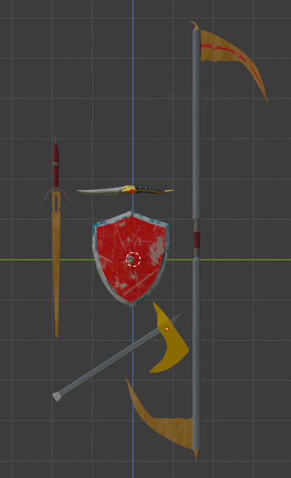

# Diario del secondo progetto di Interative 3d Graphics

Il sito presenta una piccola sezione che contiene la scena con cui l'utente può interagire. Gli oggetti disponibili sono:
- un'ascia;
- uno scudo;
- una spada;
- una piccola spada(non gestita tramite shaders);
- una falce.
Invece, i materiali disponibili sono:
- metallo;
- oro;
- legno;
- metallo pitturato;
- argento;
- tessuto.

# Realizzazione modelli 3d

Per la realizzazione dei modelli 3d si è deciso di utilizzare il software Blender. I modelli sono stati creati in maniera libera senza niente come base.

# BRDF e luci

La BRDF utilizzata è la seguente: BRDF classica sommata alla BRDF prodotta dalla componente ambientale speculare e da quella diffusiva. La luce è una semplice pointLight che non viene effettivamente aggiunta alla scena. Per quanto riguarda cspec, non c'è una vera texture speculare da cui ottenere il valore, ma è stata ottenuta tramite la metalnessMap seguendo la logica trovata nella seguente pagina e ai collegamenti contenuti https://medium.com/gametextures/metallic-magic-2dce9001fe15 .

Per quanto riguarda la BRDF utilizzata, è stata trovata andando a cercare tipologie comuni di BRDF usate. Dopo un certo periodo passato a cercare della documentazione è stata trovata una  pagina su Github che fa riferimento a "https://www.unrealengine.com/blog/physically-based-shading-on-mobile - environmentBRDF for GGX on mobile". La pagina è la seguente: https://github.com/mrdoob/three.js/blob/dev/src/renderers/shaders/ShaderChunk/bsdfs.glsl.js .

Oltre a questo è stato aggiunto un elemento emissivo per quanto riguarda la parte interna della lama della falce. Inoltre le due lame della falce e le due punte sono state realizzate considerando la rifrazione per dare l'effetto che sembrino in vetro

# Controlli utente

All'interno della scena in cui l'utente può interagire con gli oggetti, sono stati aggiunti dei controlli relativi alla rotazione e alla dimensione degli oggetti. Inoltre, può controllare la luce generale e le sue relative impostazioni. Oltre a questi controlli, è stata aggiunta la possibilità di modificare l'indice di rifrazione della falce, ma anche il colore emissivo.

# Possibili modifiche

La principale modifica da realizzare riguarda la spada piccola. Il motivo è semplice, ovvero non viene renderizzata tramite gli shaders. Questo problema è dovuto a come è stata realizzata. Infatti, invece di utilizzare il generico materiale BSDF di blender si è prima tentato di utilizzare glassBSDF e translucidBSDF, ma si è scoperto in seguito che l'esportazione di modelli, da blender, con queste caratteristiche non funziona correttamente. La prima soluzione, è stata utilizzare genericBSDF per tutti. Ma, usando la normale BRDF il modello non assumeva il colore corretto, ma veniva influenzato fortemente dalla luce ambientale. La soluzione applicata consiste nell'assegnare all'oggetto il suo materiale e aggiungere due luci alla scena, senza ricorrere ai due shaders.
